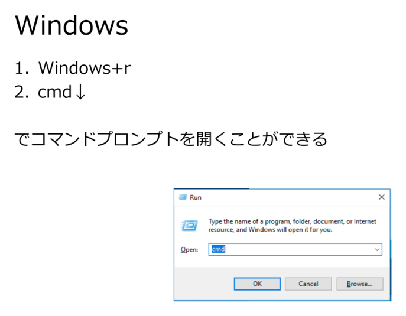
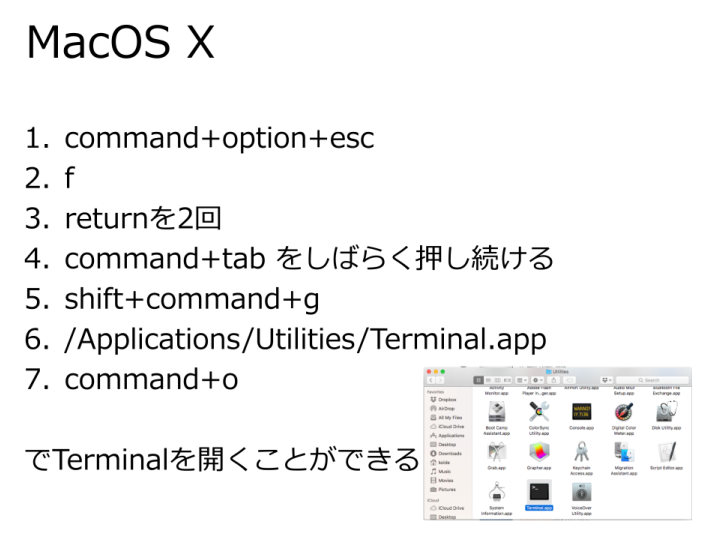

# ジグソー資料1 ── キーボードだけで OS を操作する

- **位置づけ**: SECCON BadUSB ハンズオンの導入(ジグソー法・資料1/3)
- **ねらい**: マウスに頼らず、キーボードだけで OS のウィンドウ操作・アプリ起動ができることを体感する
- **進め方**: 自分の OS の編(Windows 編 / Mac 編)に取り組み、[ワークシート](jigsaw-worksheet.md)に発見を書き留める

---

## この資料の論理(何のためにやるか)

ここで確かめたいのは、たった一つの事実です。

> **GUI 操作のほとんどは、マウスを使わずキーボードだけで再現できる。**

ウィンドウの移動・切り替え、メニュー操作、アプリ起動、スクリーンショット ──
「マウスでやるもの」と思っていた操作が、キー入力の組み合わせで届いてしまう。

この事実が、[BadUSB 本編](seccon-ws-badusb-rp2040.md)の核心に直結します。
BadUSB デバイスは **HID キーボードとして** ホストに認識され、キー入力しか送れません。
にもかかわらず危険なのは、**キーボードだけで OS のほぼ全域に手が届く**からです。
つまりこの資料での発見が、そのまま「なぜ HID 注入が脅威になるのか」の答えになります。

手を動かしながら、**「キーボードだけで、どこまでできてしまったか」** を意識してください。

## 倫理と前提

> - 操作は **自分の PC(または許可された演習端末)** の上だけで行う。
> - 破壊的な操作(ファイル削除・設定変更など)は試さない。アプリを開く・切り替える程度に留める。
> - ここでの目的は「便利技の習得」ではなく、**キーボード入力の到達範囲を体で知る**こと。

---

## 【Windows 編】

Windows 全体の操作 ── たとえばウィンドウの移動や切り替え、メニューやコマンドの実行は、
実はキーボードだけでもかなりのことができるように作られています。ちょっと試してみましょう。

### まず試す基本操作

| やりたいこと | キー操作 |
|---|---|
| スタート/検索を開く | <kbd>Windows</kbd> |
| ファイル名を指定して実行 | <kbd>Windows</kbd>+<kbd>R</kbd> |
| ウィンドウを切り替える | <kbd>Alt</kbd>+<kbd>Tab</kbd> |
| ウィンドウを左右に寄せる | <kbd>Windows</kbd>+<kbd>←</kbd> / <kbd>→</kbd> |
| デスクトップを表示 | <kbd>Windows</kbd>+<kbd>D</kbd> |
| スクリーンショット | <kbd>Windows</kbd>+<kbd>Shift</kbd>+<kbd>S</kbd> |
| メニューにアクセス | <kbd>Alt</kbd>(各アプリのメニューにキーヒントが出る) |

### 調べて書き留める

このことを踏まえて、以下を試してみてください。

1. 他にどんな操作があるか調べてみましょう。たとえばウィンドウの切り替えや移動、
   スクリーンショットの撮影などはできそうでしょうか? 書き留めておきましょう。
2. いろいろ組み合わせて、いろんなアプリを起動して操作してみましょう。
   マウスなしでボタンのクリックはできそうですか?(<kbd>Tab</kbd> で移動 → <kbd>Enter</kbd>/<kbd>Space</kbd> で押下)
   何ができたか、書き留めておきましょう。

---

## 【Mac 編】

Mac 全体の操作 ── たとえばメニューやコマンドの実行は、
実はキーボードだけでもかなりのことができるように作られています。ちょっと試してみましょう。

### まず試す基本操作

| やりたいこと | キー操作 |
|---|---|
| Spotlight(検索/アプリ起動) | <kbd>⌘</kbd>+<kbd>Space</kbd> |
| アプリを切り替える | <kbd>⌘</kbd>+<kbd>Tab</kbd> |
| ウィンドウを切り替える(同一アプリ) | <kbd>⌘</kbd>+<kbd>`</kbd> |
| メニューバーにアクセス | <kbd>Control</kbd>+<kbd>F2</kbd>(フルキーボードアクセス) |
| スクリーンショット | <kbd>⌘</kbd>+<kbd>Shift</kbd>+<kbd>4</kbd> |
| Mission Control | <kbd>Control</kbd>+<kbd>↑</kbd> |

> フルキーボードアクセス(<kbd>Control</kbd>+<kbd>F2</kbd> や <kbd>Tab</kbd> でのフォーカス移動)は、
> システム設定の「キーボード」で有効化が必要な場合があります。

### 調べて書き留める

このことを踏まえて、以下を試してみてください。

1. 他にどんな操作があるか調べてみましょう。たとえばウィンドウの切り替えや移動、
   スクリーンショットの撮影などはできそうでしょうか? 書き留めておきましょう。
2. いろいろ組み合わせて、いろんなアプリを起動して操作してみましょう。
   マウスなしでボタンのクリックはできそうですか? 何ができたか、書き留めておきましょう。

---

## 参考画像(元資料より)

元の Word 資料に埋め込まれていた、キーボードだけでコマンドプロンプト/ターミナルを開く手順の図です。

**Windows: <kbd>Windows</kbd>+<kbd>R</kbd> → `cmd` → <kbd>Enter</kbd> でコマンドプロンプトを開く**

**macOS: キーボード操作でターミナルを開く**

> 元は Windows メタファイル(EMF、GitHub・Mac でプレビュー不可)だったため PNG へ変換した。
> 変換前の EMF も `assets/jigsaw-1/` に原本として残してある。

---

## 振り返り

- キーボードだけで「ここまでできる」と分かったことを [ワークシート](jigsaw-worksheet.md) にまとめる。
- **問い**: これらの操作が、あなたの許可なく・超高速で・自動で実行されたら何が起きるか?
  それが次に作る BadUSB デバイスの正体です。
